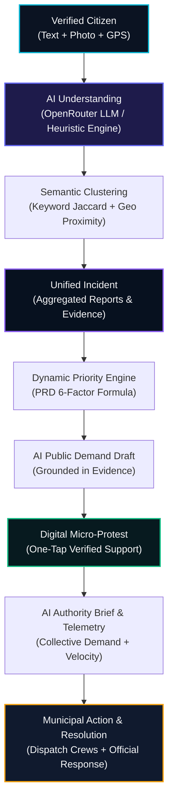
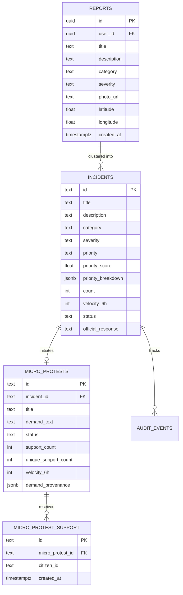

# 🛡️ CivicShield — AI-Powered Civic Intelligence & Digital Micro-Protest Platform

[](https://react.dev/)
[](https://vitejs.dev/)
[](https://openrouter.ai/)
[](https://supabase.com/)
[](https://leafletjs.com/)
[](https://www.framer.com/motion/)
[](LICENSE)

> **CivicShield** is a verified civic intelligence and collective action platform built to convert scattered, unstructured citizen complaints into structured incidents, transparent priority ratings, and actionable municipal dispatch dossiers.
>
> Featuring the **Digital Micro-Protest** protocol, CivicShield enables authenticated citizens to back legitimate, non-violent civic demands with one-tap verified support—creating a measurable, noise-free civic signal that compels municipal accountability.

---

## 📑 Table of Contents

- [Core Innovations](#-core-innovations)
  - [1. Digital Micro-Protest (P0 Focus)](#1-digital-micro-protest-p0-focus)
  - [2. Explainable Dynamic Priority Algorithm](#2-explainable-dynamic-priority-algorithm)
  - [3. Real AI Pipeline via OpenRouter](#3-real-ai-pipeline-via-openrouter)
  - [4. Interactive Cyber-Civic Leaflet Map](#4-interactive-cyber-civic-leaflet-map)
  - [5. Municipal Authority Operations Command](#5-municipal-authority-operations-command)
  - [6. Citizen Identity Verification (Aadhaar / Gov ID)](#6-citizen-identity-verification-aadhaar--gov-id)
- [System Architecture & Lifecycle](#-system-architecture--lifecycle)
- [Client Application Routes](#-client-application-routes)
- [Database Schema & Migration](#-database-schema--migration)
- [Security & Defensive Controls](#-security--defensive-controls)
- [Getting Started](#-getting-started)
  - [Prerequisites](#prerequisites)
  - [Environment Variables](#environment-variables)
  - [Installation & Setup](#installation--setup)
  - [Running Locally](#running-locally)
  - [Build & Code Quality](#build--code-quality)
- [Contributing](#-contributing)
- [License](#-license)

---

## ⚡ Core Innovations

### 1. Digital Micro-Protest (P0 Focus)

Traditional civic platforms either ignore public demand or produce noisy, unverified comment sections. CivicShield implements a structured, constitutionally grounded **Digital Micro-Protest** mechanism:
- **Grounded AI Demand Drafting**: Generates concise, actionable, non-threatening demands tied directly to clustered evidence and specific municipal departments.
- **Strict One-Citizen-One-Vote**: Enforced transactionally in the database with `UNIQUE(micro_protest_id, citizen_id)` to eliminate artificial manipulation and astroturfing.
- **Support Velocity Tracking**: Computes real-time 6-hour support acceleration (e.g., `+184 in last 6h`) to identify rapidly escalating public hazards.
- **Non-Violent & Lawful by Design**: Pure digital petition mechanism; strictly avoids physical gathering, traffic obstruction, or public inconvenience.

---

### 2. Explainable Dynamic Priority Algorithm

Rather than relying on opaque black-box scoring, CivicShield computes incident priority using a mathematically transparent, audited 6-factor model:

$$\text{Priority} = 0.25 \cdot S + 0.20 \cdot I + 0.20 \cdot V + 0.15 \cdot v_{6h} + 0.10 \cdot C + 0.10 \cdot E$$

| Factor | Symbol | Weight | Description |
| :--- | :---: | :---: | :--- |
| **Severity** | $S$ | **25%** | Intrinsic hazard rating (Critical: 1.0, High: 0.8, Medium: 0.5, Low: 0.2) |
| **Impact Scope** | $I$ | **20%** | Geographic reach (City-wide: 1.0, Ward-wide: 0.8, Neighborhood: 0.5, Local: 0.2) |
| **Report Volume** | $V$ | **20%** | Log-normalized count of clustered citizen reports ($\log_{10}(1 + N) / 2$) |
| **Support Velocity** | $v_{6h}$ | **15%** | Rate of new verified citizen supports over the past 6 hours |
| **AI Confidence** | $C$ | **10%** | Neural classification confidence ($0.70 \to 0.99$) |
| **Evidence Quality** | $E$ | **10%** | Ratio of verified photographic evidence uploads |

> Citizens and municipal officers can toggle the **Inspect Algorithm Breakdown** view in any incident modal to review the exact percentage contribution of each factor.

---

### 3. Real AI Pipeline via OpenRouter

CivicShield connects directly to [OpenRouter](https://openrouter.ai/) for real-time neural inference with zero vendor lock-in:
- **Default Models**: Supports `nvidia/nemotron-3.5-lightning:free`, `google/gemini-2.0-flash-001`, `meta-llama/llama-3.3-70b-instruct`, `anthropic/claude-3.5-sonnet`, etc.
- **Multi-Factor Triage (`analyzeCivicReportAsync`)**: Extracts category, sub-category, severity score, impact score, civic entities, and dispatch summary.
- **Demand Synthesis (`generatePublicDemandAsync`)**: Drafts legitimate civic demands specifying explicit remedies and public works timelines.
- **Authority Brief Synthesis (`generateAuthorityBriefAsync`)**: Synthesizes 4-step technical action checklists for field engineers and commissioners.
- **Resilient Fallback Engine**: If the API key is missing or encounters rate limits, the platform instantly falls back to its deterministic local neural core with **zero crashes**.
- **Model Attribution**: Badges in the UI (e.g. `⚡ nvidia/nemotron-3.5-lightning:free`) reflect the active neural inference engine.

---

### 4. Interactive Cyber-Civic Leaflet Map

- Located at [`/incidents`](http://localhost:5173/incidents).
- Utilizes **Leaflet** with CartoDB Dark Matter tiles.
- Pins render animated pulsing halos (`pin-pulse`) color-coded by severity:
  - 🔴 **Critical**: Vibrant Red pulse
  - 🟠 **High**: Amber pulse
  - 🔵 **Medium**: Cyan pulse
  - 🟢 **Low**: Emerald pulse
- Interactive popups allow one-click deep-dive into full incident telemetry.

---

### 5. Specialized Government Operations Command Portal

- Located at [`/government`](http://localhost:5173/government) (and [`/authority`](http://localhost:5173/authority)).
- **Restricted Government Official Authentication Gate**:
  - Secure verification against seeded municipal officer credentials in `.env`.
  - **1-Click Demo Helper**: Autofills official credentials for instant evaluator testing.
  - **Seeded Official Credentials**:
    - **Official ID**: `GOV-OFFICER-7042`
    - **Email**: `officer.sharma@pwd.delhi.gov.in`
    - **Password**: `GovShield#Secure2026!`
    - **Department**: `Public Works Department (PWD)`
    - **Officer**: `Er. Rajesh Sharma (Chief Municipal Engineer)`
- **Citizen Posts & Reports Queue**:
  - Review all citizen submissions with full photo evidence, timestamps, and GPS coordinates.
  - **Verify Post (1-Click)**: Grants an official **Gov Verified 🏛️** badge stamped with officer name and timestamp.
  - **Mention / Set Priority**: Override or set priority (P0 - Emergency Dispatch, P1 - Urgent Municipal Attention, P2 - Standard, P3 - Routine) with official justification.
  - **Announce Work to Citizens**: Broadcast official status announcements (e.g. *"Field repair crew dispatched. Bituminous patching in progress"*) directly visible on the citizen's report and public feed.
  - **Field Crew Dispatcher**: Designate crew units, target ETAs, and field supervisor contacts.
  - **Official Resolution Closure**: Mark issues resolved with resolution proof photo attachment.
  - **Export Municipal Work Order**: Format and print/export structured official Municipal Dispatch Memos.
- **City-Wide Emergency Civic Advisories**:
  - Issue high-priority emergency broadcast banners that appear live across all citizen dashboards.

---

### 6. Citizen Identity Verification (Aadhaar / Gov ID)

- **Sybil Resistance**: Ensures only authenticated individuals can vote on Micro-Protests.
- **Verification Flow**: 12-digit format mask $\to$ OTP generation simulation $\to$ verification validation $\to$ persistent cryptographic token badge issuance.
- **Demo Auto-Fill**: One-click demo verification with test OTP `123456`.

---

## 🔄 System Architecture & Lifecycle



---

## 🧭 Client Application Routes

| Path | Component | Description |
| :--- | :--- | :--- |
| `/` | [`App.jsx`](src/App.jsx) | Landing page with hero telemetry, live ticker, feature highlights, and civic timeline |
| `/dashboard` | [`Dashboard.jsx`](src/pages/Dashboard.jsx) | Citizen command terminal: incident reporting, photo upload, AI triage review, and cluster feedback |
| `/incidents` | [`Incidents.jsx`](src/pages/Incidents.jsx) | Public explorer with interactive CartoDB Leaflet map, search, category filters, and Micro-Protest cards |
| `/authority` | [`AuthorityDashboard.jsx`](src/pages/AuthorityDashboard.jsx) | Municipal dispatch command: priority queue, AI action checklist, status updating, and official replies |
| `/login` | [`Login.jsx`](src/pages/Login.jsx) | Citizen sign-in terminal with brute-force lockout protection |
| `/register` | [`Register.jsx`](src/pages/Register.jsx) | Citizen account registration with password complexity helper |
| `/reset-password` | [`ResetPassword.jsx`](src/pages/ResetPassword.jsx) | Credential recovery update page |

---

## 🗄️ Database Schema & Migration

Database migration script located at [`supabase/migrations/20260908_civic_intelligence_micro_protest.sql`](supabase/migrations/20260908_civic_intelligence_micro_protest.sql).

### Key Entities



---

## 🔒 Security & Defensive Controls

1. **Strict Environment Secret Isolation**:
   - All API keys and model parameters are kept in `.env.local` and never committed to source control.
   - [`.gitignore`](.gitignore) explicitly blocks `.env`, `.env.local`, and `*.local`.
2. **Brute-Force & Credential Stuffing Defense**:
   - Exponential backoff lockout (30s $\to$ 2min $\to$ 15min) with live countdown timer.
3. **Sybil Resistance & Anti-Astroturfing**:
   - Identity verification check before accepting Micro-Protest support.
   - Database `UNIQUE` constraint preventing duplicate voting.
4. **SQL & XSS Sanitization**:
   - Multi-layer regex sanitizer (`sanitizeInput`) stripping SQL keywords, HTML tags, and null bytes.
5. **Photo Upload Hardening**:
   - Strict MIME validation allowlist (`image/jpeg`, `image/png`, `image/webp`).
   - Rejection of SVG vectors and binaries; 5MB payload boundary.

---

## 🚀 Getting Started

### Prerequisites

- [Node.js](https://nodejs.org/) (v18.0 or higher)
- [npm](https://www.npmjs.com/)
- A [Supabase Project](https://supabase.com/) instance
- *(Optional)* An [OpenRouter API Key](https://openrouter.ai/keys) for live LLM reasoning

---

### Environment Variables

Copy `.env.example` to `.env.local`:

```bash
cp .env.example .env.local
```

Populate your credentials in `.env.local`:

```env
VITE_SUPABASE_URL=https://your-project.supabase.co
VITE_SUPABASE_PUBLISHABLE_KEY=your-supabase-publishable-key

# OpenRouter Real AI Integration (Optional but recommended)
VITE_OPENROUTER_API_KEY=sk-or-v1-your-key-here
VITE_OPENROUTER_MODEL=nvidia/nemotron-3.5-lightning:free
```

---

### Installation & Setup

```bash
git clone https://github.com/dyutimaymondal/CivicShield.git
cd CivicShield
npm install
```

---

### Running Locally

```bash
npm run dev
```

Navigate to: `http://localhost:5173`

---

### Build & Code Quality

```bash
# High-speed static analysis (0 warnings, 0 errors target)
npx oxlint

# Production build
npm run build

# Preview production build locally
npm run preview
```

---

## 🤝 Contributing

1. Fork the repository
2. Create your feature branch (`git checkout -b feature/AmazingFeature`)
3. Commit your changes (`git commit -m "feat: implement AmazingFeature"`)
4. Push to the branch (`git push origin feature/AmazingFeature`)
5. Open a Pull Request

---

## 📄 License

Distributed under the MIT License. See [LICENSE](LICENSE) for details.
