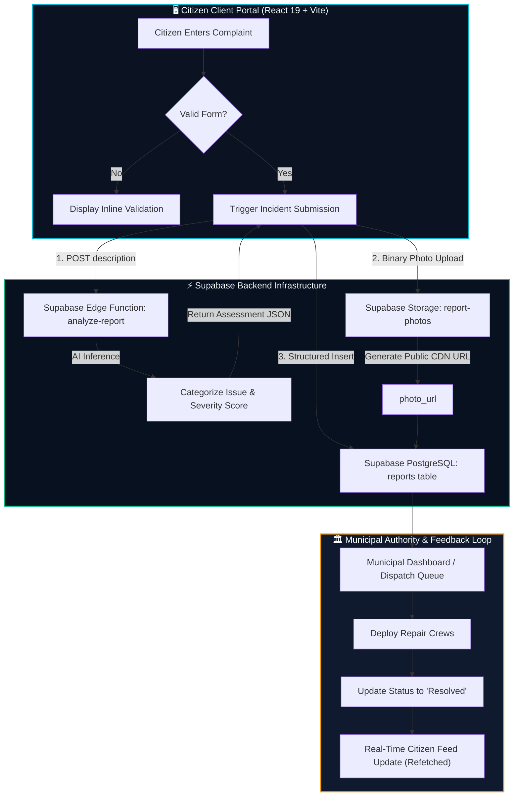

# 🛡️ CivicShield — AI-Powered Civic Intelligence Platform

[](https://react.dev/)
[](https://vitejs.dev/)
[](https://supabase.com/)
[](https://www.framer.com/motion/)
[](LICENSE)

> **CivicShield** is a modern, cyber-civic intelligence infrastructure platform designed to bridge the gap between decentralized citizen complaints and municipal authority response. By combining real-time complaint intake, autonomous AI incident triage, duplicate detection clustering, and evidence storage, CivicShield turns fragmented neighborhood issues into validated, high-priority public works actions.

---

## 📑 Table of Contents

- [Key Features](#-key-features)
- [Architecture & Workflow Flowchart](#-architecture--workflow-flowchart)
- [API Routes & Supabase Backend Services](#-api-routes--supabase-backend-services)
- [Client Application Routes](#-client-application-routes)
- [Database Schema](#-database-schema)
- [Tech Stack](#-tech-stack)
- [Getting Started](#-getting-started)
  - [Prerequisites](#prerequisites)
  - [Environment Variables](#environment-variables)
  - [Installation & Setup](#installation--setup)
  - [Running Locally](#running-locally)
  - [Build & Lint](#build--lint)
- [Contributing](#-contributing)
- [License](#-license)

---

## ⚡ Key Features

- **🚨 Smart Citizen Reporting**: Citizens log issues with contextual descriptions, landmark geolocation, and direct photo evidence upload.
- **🧠 Autonomous AI Triage**: Integrated Supabase Edge Function analyzes complaints in real time to categorize public works domains, evaluate risk severity, and produce dispatch-ready briefs.
- **🔗 Duplicate Clustering**: Groups related municipal complaints within geographical zones to eliminate department triage redundancy.
- **📊 Real-Time Operations Command**: Interactive citizen portal with live KPI metric ribbons, report status filters (`All`, `Pending`, `Resolved`), and neural assessment verification.
- **🔐 Secure Authentication**: Supabase-powered session management, password reset recovery links, and user role separation.
- **💎 Cyber-Civic Design System**: High-contrast obsidian dark mode, responsive glassmorphism panels, Lucide vector icons, and Framer Motion micro-interactions.

---

## 🔄 Architecture & Workflow Flowchart

The following diagram illustrates the lifecycle of a civic incident—from citizen submission to AI synthesis, database persistence, and authority resolution:



---

## 🌐 API Routes & Supabase Backend Services

CivicShield utilizes Supabase Edge Functions, Auth APIs, PostgreSQL Database RPCs, and Object Storage.

### 1. AI Analysis Edge Function

Invoked during the submission workflow to categorize and rate complaints.

- **Function Name**: `analyze-report`
- **Client Invocation**:
  ```javascript
  const { data, error } = await supabase.functions.invoke("analyze-report", {
    body: { description: userDescription }
  });
  ```
- **Request Payload**:
  ```json
  {
    "description": "Large pothole on 4th cross road causing hazardous vehicle swerving."
  }
  ```
- **Response Structure**:
  ```json
  {
    "issue": "Major Road Surface Damage",
    "category": "Roads & Transportation",
    "severity": "High",
    "priority": "P1 - Immediate Dispatch",
    "summary": "Severe pothole cluster on primary thoroughfare posing vehicular damage risk."
  }
  ```

---

### 2. Supabase Storage: `report-photos`

Used to store photographic proof uploaded by citizens.

- **Bucket Name**: `report-photos`
- **Access Level**: Public Read, Authenticated Upload
- **Path Convention**: `{user_id}/{timestamp}.{ext}`
- **Storage Workflow**:
  ```javascript
  // 1. Upload file binary
  await supabase.storage
    .from("report-photos")
    .upload(`${user.id}/${Date.now()}.${fileExtension}`, photoFile);

  // 2. Retrieve public access URL
  const { data } = supabase.storage
    .from("report-photos")
    .getPublicUrl(filePath);
  ```

---

### 3. Supabase Authentication Methods

| Action | Supabase Client Method | Redirect Target | Description |
| :--- | :--- | :--- | :--- |
| **Sign In** | `supabase.auth.signInWithPassword({ email, password })` | `/dashboard` | Authenticates existing citizen session |
| **Sign Up** | `supabase.auth.signUp({ email, password, options: { data: { full_name } } })` | `/` (on session) | Registers citizen with profile metadata |
| **Forgot Password** | `supabase.auth.resetPasswordForEmail(email, { redirectTo })` | Email Link ➔ `/reset-password` | Sends secure recovery link to citizen's inbox |
| **Update Password** | `supabase.auth.updateUser({ password })` | `/login` | Commits updated password for authenticated session |
| **Sign Out** | `supabase.auth.signOut()` | `/login` | Invalidates tokens and terminates local session |

---

## 🧭 Client Application Routes

| Path | Component | View Description |
| :--- | :--- | :--- |
| `/` | [`App.jsx`](src/App.jsx) | Public Landing Page featuring hero telemetry, live incident ticker, features grid, civic workflow timeline, and footer |
| `/login` | [`Login.jsx`](src/pages/Login.jsx) | Citizen sign-in terminal with floating glassmorphism card and password recovery trigger |
| `/register` | [`Register.jsx`](src/pages/Register.jsx) | Account creation terminal with input validation and security helper text |
| `/reset-password` | [`ResetPassword.jsx`](src/pages/ResetPassword.jsx) | Secure credential update page for users redirected via email recovery tokens |
| `/dashboard` | [`Dashboard.jsx`](src/pages/Dashboard.jsx) | Citizen Command Portal with live metric stats, report submission dropzone, AI telemetry card, and filtered incident cards |

---

## 🗄️ Database Schema

### Table: `reports`

| Column | Data Type | Constraints | Description |
| :--- | :--- | :--- | :--- |
| `id` | `uuid` | Primary Key, `default gen_random_uuid()` | Unique record identifier |
| `user_id` | `uuid` | Foreign Key `auth.users(id)` | Author citizen user ID |
| `title` | `text` | Nullable | User-provided or AI-synthesized incident headline |
| `description` | `text` | Not Null | Detailed citizen complaint narrative |
| `category` | `text` | Nullable | Assigned municipal department domain |
| `location` | `text` | Nullable | Street address, landmark, or coordinates |
| `photo_url` | `text` | Nullable | Public URL from `report-photos` bucket |
| `status` | `text` | Default `'pending'` | Incident state: `'pending'` \| `'resolved'` |
| `severity` | `text` | Nullable | Risk evaluation: `'Low'` \| `'Medium'` \| `'High'` \| `'Critical'` |
| `created_at` | `timestamptz`| `default now()` | Timestamp of incident intake |

---

## 🛠️ Tech Stack

- **Core Framework**: [React 19](https://react.dev/) + [Vite 8](https://vitejs.dev/)
- **Routing**: [React Router v7](https://reactrouter.com/)
- **Backend & Database**: [Supabase](https://supabase.com/) (PostgreSQL, Supabase Auth, Storage, Edge Functions)
- **Styling**: Cyber-Civic Vanilla CSS Architecture (CSS Variables, Flexbox, CSS Grid, Glassmorphism)
- **Vector Icons**: [Lucide React](https://lucide.dev/)
- **Animations**: [Framer Motion 13](https://www.framer.com/motion/)
- **Linter & Code Quality**: [Oxlint](https://oxc.rs/)

---

## 🚀 Getting Started

### Prerequisites

- [Node.js](https://nodejs.org/) (v18.0 or higher recommended)
- [npm](https://www.npmjs.com/) or [pnpm](https://pnpm.io/)
- A [Supabase Project](https://supabase.com/) instance

---

### Environment Variables

Create a `.env.local` file in the root directory:

```env
VITE_SUPABASE_URL=https://your-supabase-project.supabase.co
VITE_SUPABASE_PUBLISHABLE_KEY=your-supabase-publishable-key
```

---

### Installation & Setup

1. **Clone the repository**:
   ```bash
   git clone https://github.com/dyutimaymondal/CivicShield.git
   cd CivicShield
   ```

2. **Install project dependencies**:
   ```bash
   npm install
   ```

3. **Verify Environment Setup**:
   Ensure `.env.local` contains your active Supabase URL and Publishable Key.

---

### Running Locally

Start the local development server with Hot Module Replacement (HMR):

```bash
npm run dev
```

Open your browser and navigate to:
```
http://localhost:5173
```

---

### Build & Lint

To build the production-ready bundle:
```bash
npm run build
```

To run the high-speed code linter:
```bash
npm run lint
```

To preview the production build locally:
```bash
npm run preview
```

---

## 🤝 Contributing

Contributions, issues, and feature requests are welcome!

1. Fork the repository
2. Create your feature branch (`git checkout -b feature/AmazingFeature`)
3. Commit your changes (`git commit -m "feat: Add AmazingFeature"`)
4. Push to the branch (`git push origin feature/AmazingFeature`)
5. Open a Pull Request

---

## 📄 License

This project is licensed under the MIT License — see the [LICENSE](LICENSE) file for details.
